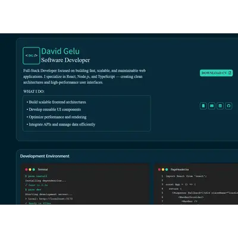

# Interactive Portfolio — React + TypeScript

> Personal developer portfolio showcasing projects, skills, and experience. Built with a focus on reusable components, clean architecture, and optimized rendering.

[](https://davidgelu.netlify.app)
[](https://www.typescriptlang.org/)
[](https://sass-lang.com/)
[](https://www.cypress.io/)

---

## 📸 Preview

 
> 🔗 **[View live →](https://davidgelu.netlify.app)**

---

## ✨ Features

- **Project showcase** — filterable gallery of personal and professional projects with live demo and source code links
- **Interactive CV** — downloadable PDF version of the resume built directly into the UI
- **Responsive design** — optimized for all screen sizes
- **Reusable component system** — modular architecture with typed props throughout
- **Smooth navigation** — section-based layout with scroll and routing
- **E2E tested** — Cypress test suite covering key user flows

---

## 🛠️ Tech Stack

| Technology | Purpose |
|---|---|
| React 18 + TypeScript | UI framework |
| Vite | Build tool & dev server |
| SCSS | Component-level styling |
| Tailwind CSS | Utility classes |
| Cypress | End-to-end testing |
| Yarn | Package management |

---


## 📁 Project Structure

```
react-portfolio/
├── cypress/           # E2E test suites
├── public/            # Static assets
├── src/
│   ├── components/    # Reusable UI components
│   ├── pages/         # Route-level views
│   ├── assets/        # Images, icons, fonts
│   └── styles/        # Global SCSS variables and mixins
├── vite.config.ts
├── tsconfig.json
└── cypress.config.ts
```

---

## 📌 Featured Projects (showcased in portfolio)

| Project | Stack | Description |
|---|---|---|
| [Daily Tasks](https://github.com/david-gelu/time-manager) | React, Node.js, MongoDB, Firebase | Full-stack task manager with Kanban, Calendar, and Time Zone Converter |
| [Interactive CV](https://davidgelu-cv.netlify.app) | React, TypeScript | Dynamic CV with downloadable PDF export |
| [Image Transformer](https://image-transformer-app.vercel.app) | React, TypeScript | Real-time image processing tool |
| [Time Passed Since](https://time-passed.netlify.app/) | React, TypeScript | Real-time time calculation utility |
| [Difference Checker](https://checker-js.netlify.app/) | React, TypeScript | Input validation and comparison tool |
| [Tasks project](https://tasks-dv.vercel.app/)| Nextjs, TypeScript | Fullstack with Nextjs Auth |
| [Books Project](https://booksproject.netlify.app/) | React, TypeScript | Book listing and management interface |

---

## 👤 Author

**David Gelu-Fanel** — Full-Stack Developer

[](https://davidgelu.netlify.app)
[](https://linkedin.com/in/gelu-fanel-david)
[](https://github.com/david-gelu)